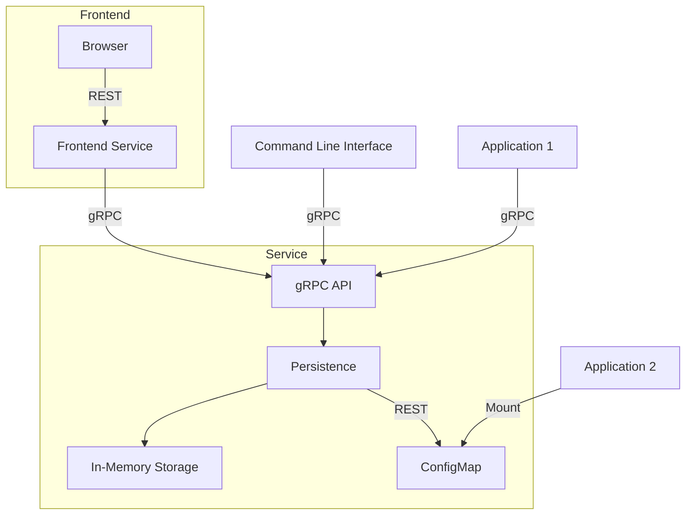

# Feature

Simple feature flag service designed for Kubernetes.

Related components:

- [UI README](./ui/README.md)
- [CLI README](./cli/README.md)
- [Service README](./service/README.md)
- [Helm Chart README](./charts/feature/README.md)
- [Demo README](./demo/README.md)

## Overview

## Features

* Available as OCI containers
* Multi architecture (amd64, arm64)
* gRPC API for managing feature flags
* REST API for frontend consumption
* Persistence layer with in-memory and Kubernetes ConfigMap backends
* Command Line Interface (CLI) for managing feature flags
* Designed for Kubernetes environments
* OpenTelemetry instrumentation for observability
* Configurable via environment variables and ConfigMaps
* Lightweight and easy to deploy
