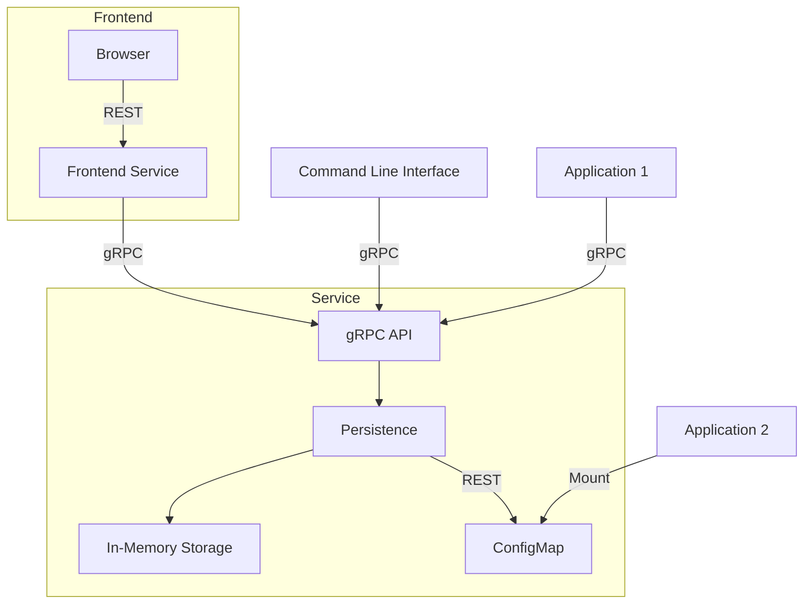

# Feature

Simple feature flag service designed for Kubernetes.

Related components:

- [UI README](./ui/README.md)
- [CLI README](./cli/README.md)
- [Service README](./service/README.md)
- [Helm Chart README](./charts/feature/README.md)

