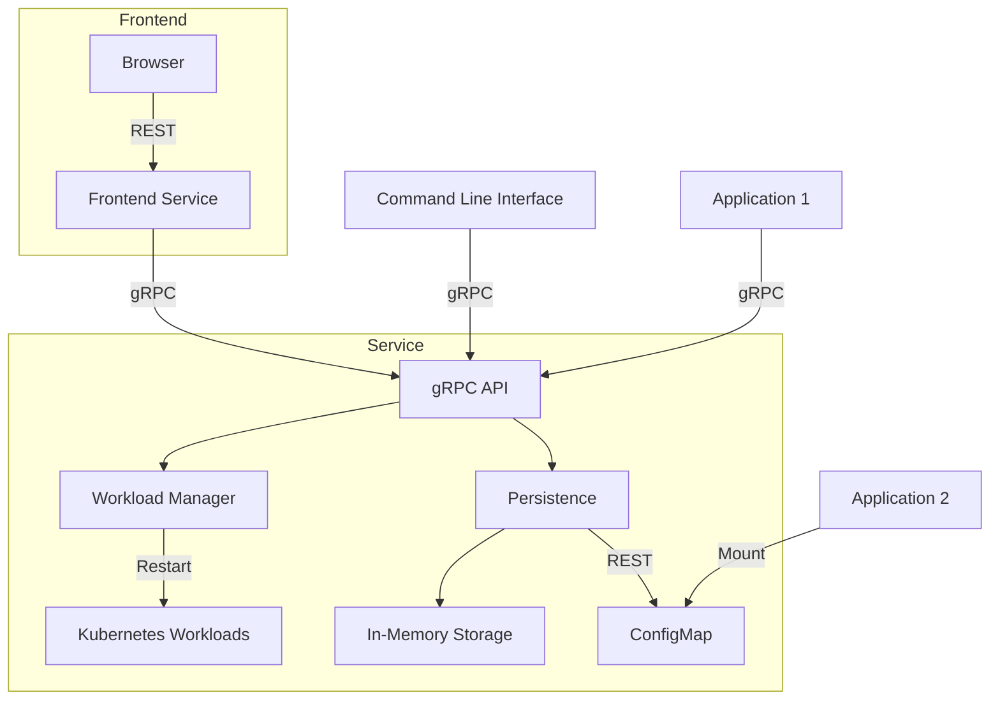

# Feature

Simple feature flag service designed for Kubernetes.

Related components:

- [UI README](./ui/README.md)
- [CLI README](./cli/README.md)
- [Service README](./service/README.md)
- [Helm Chart README](./charts/feature/README.md)
- [Demo README](./demo/README.md)

## Overview


## Features

* Available as OCI containers
* Multi architecture (amd64, arm64)
* gRPC API for managing feature flags
* REST API for frontend consumption
* Persistence layer with in-memory and Kubernetes ConfigMap backends
* Command Line Interface (CLI) for managing feature flags
* Workload restart functionality for Deployments, StatefulSets, and DaemonSets
* Designed for Kubernetes environments
* OpenTelemetry instrumentation for observability
* Configurable via environment variables and ConfigMaps
* Lightweight and easy to deploy

## ConfigMap Usage and Workload Restarts

This service uses ConfigMaps for configuration management. Understanding how ConfigMaps are mounted is important for knowing when workload restarts are necessary.

### ConfigMap with `envFrom` (Restart Required)

When a ConfigMap is mounted using `envFrom` to populate environment variables:

```yaml
envFrom:
  - configMapRef:
      name: app-config
```

Environment variables are set once when the pod starts. If you update the ConfigMap (e.g., changing `LOG_LEVEL=debug` to `LOG_LEVEL=info`), the running pods continue using the old values because environment variables cannot be updated in a running process. **You must restart the deployment for pods to pick up the new environment variable values.**

This is the method used by the feature service for injecting configuration values.

### ConfigMap as Volume Mount (Auto-Update)

When a ConfigMap is mounted as a volume:

```yaml
volumeMounts:
  - name: config
    mountPath: /etc/config
volumes:
  - name: config
    configMap:
      name: app-config
```

Kubernetes automatically updates the files in the mounted volume when the ConfigMap changes (typically within 60-90 seconds due to kubelet sync period). Applications that read configuration files dynamically (e.g., nginx reloading config, apps watching file changes) can pick up updates without pod restart.

### Why the Workload Restart Feature Matters

The workload restart button in the UI is essential for the first scenario - when using `envFrom` (as this service does), updating feature flags in the ConfigMap requires restarting pods to apply changes. This feature provides a convenient UI button to trigger that restart instead of requiring kubectl access.

Use the **Workload Management** section in the UI to restart deployments, statefulsets, or daemonsets after updating their ConfigMap configuration.
