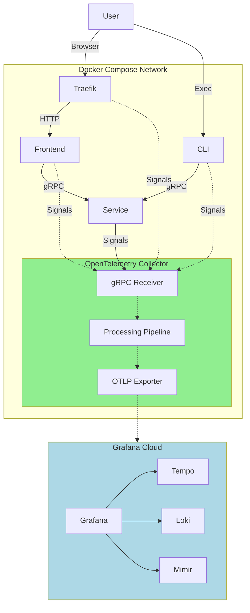

# Demo

Start demo with

```
docker compose up -d
```

Then open [http://localhost:80](http://localhost:80) in your browser.```

## Overview


```mermaid
graph TD
    style OC fill:lightgreen
    style GC fill:lightblue
    U[User]
    subgraph DC[Docker Compose Network]
    T[Traefik]
    F[Frontend]
    CLI[CLI]
    S[Service]
    subgraph OC[OpenTelemetry Collector]
      GRPC[gRPC Receiver]
      PIPE[Processing Pipeline]
      EXP[OTLP Exporter]
    end
    end
    subgraph GC[Grafana Cloud]
      TMP[Tempo]
      LOK[Loki]
      MIM[Mimir]
      GRF[Grafana]
      GRF-->TMP
      GRF-->LOK
      GRF-->MIM
    end
    T-->|HTTP|F
    F-->|gRPC|S
    CLI-->|gRPC|S
    S-->|Signals|GRPC
    GRPC-.->PIPE
    PIPE-.->EXP
    U-->|Browser|T
    U-->|Exec|CLI
    EXP-.->GC
    T-.->|Signals|GRPC
    F-.->|Signals|GRPC
    CLI-.->|Signals|GRPC
```
