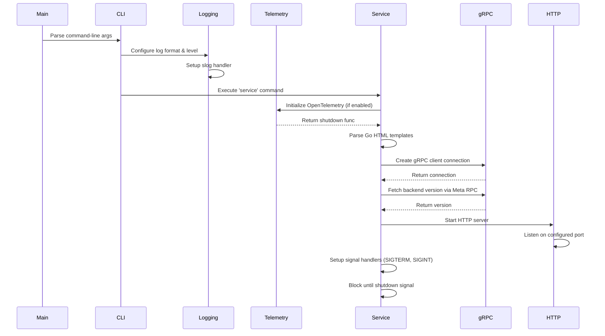
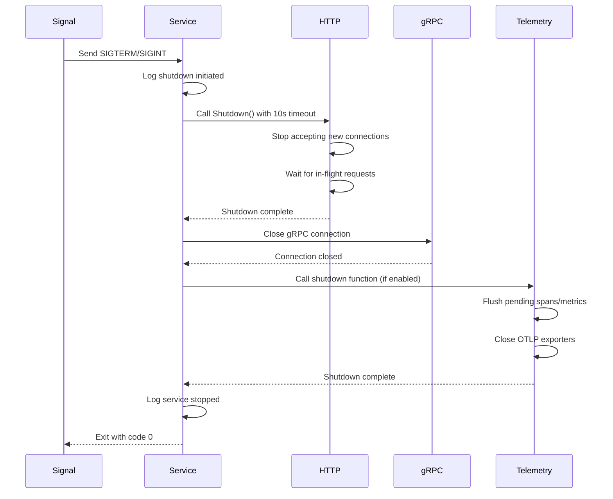
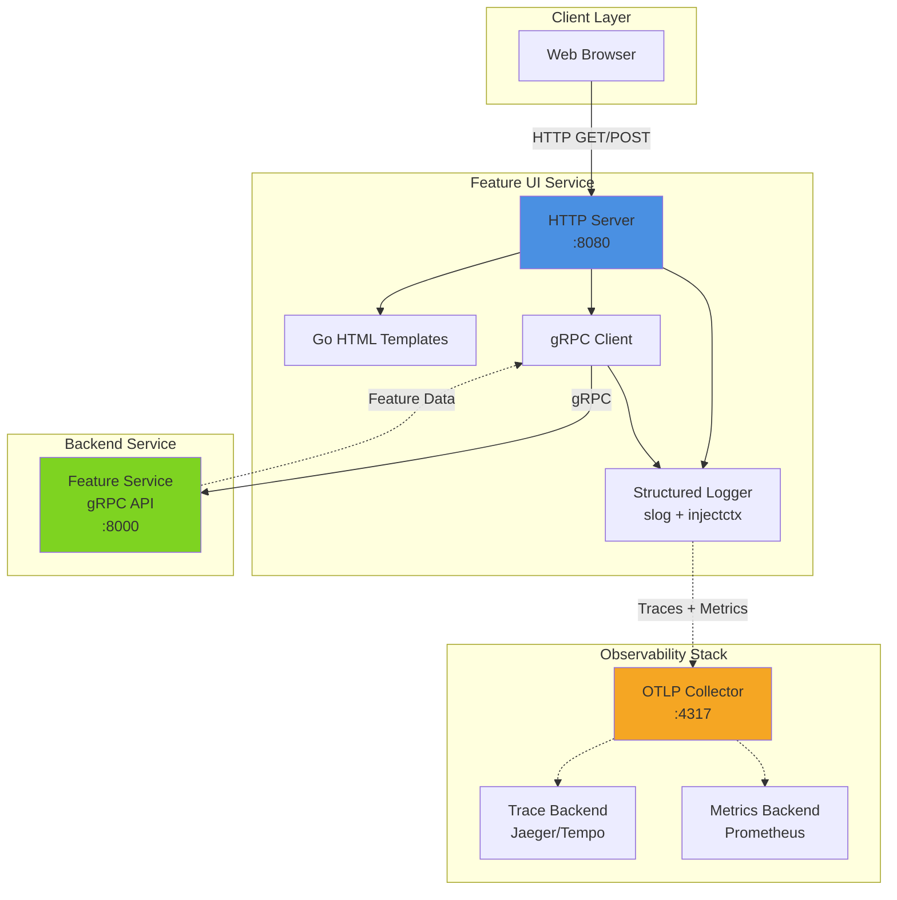
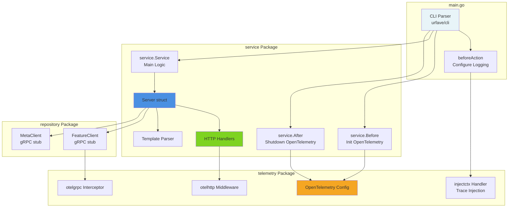

# Feature UI

Comprehensive documentation for the Feature UI service.

## Table of Contents

- [Overview](#overview)
- [Command Line Interface](#command-line-interface)
- [Environment Variables](#environment-variables)
- [HTTP Routes](#http-routes)
- [Logging Behavior](#logging-behavior)
- [OpenTelemetry Integration](#opentelemetry-integration)
- [Startup and Shutdown Lifecycle](#startup-and-shutdown-lifecycle)
- [Architecture Diagrams](#architecture-diagrams)
- [Developer Notes](#developer-notes)

## Overview

The `feature-ui` service is a web-based user interface for managing feature flags in the Feature Flag system. It provides an HTTP-based frontend that communicates with the backend gRPC API to perform CRUD operations on feature flags.

### Purpose

- Provides a web UI for managing feature flags
- Serves as an HTTP gateway to the backend gRPC service
- Implements HTMX-based dynamic UI for real-time updates
- Integrates with OpenTelemetry for observability
- Supports health checks for Kubernetes deployments

### Key Responsibilities

- **HTTP Server**: Serves HTML pages and handles HTTP requests
- **gRPC Client**: Communicates with the backend feature service via gRPC
- **Template Rendering**: Renders Go HTML templates for the UI
- **Observability**: Emits traces and metrics via OpenTelemetry
- **Logging**: Structured logging with trace context injection

## Command Line Interface

The main binary is `feature-ui`, which provides the following subcommands:

### Main Binary: `feature-ui`

```bash
feature-ui [global flags] <subcommand> [subcommand flags]
```

### Subcommands

#### `version`

Prints the version number of the feature UI service.

```bash
feature-ui version
```

**Example Output:**
```
Feature Service name=feature-ui version=v1.0.0
```

#### `service`

Starts the HTTP UI service.

```bash
feature-ui service [flags]
```

### Global Flags

These flags are available for all subcommands:

| Flag | Type | Default | Description | Environment Variable | Validation |
|------|------|---------|-------------|---------------------|------------|
| `--log-format` | string | `text` | Log format: `text` or `json` | `LOG_FORMAT` | Must be `text` or `json` |
| `--log-level` | string | `info` | Log level: `debug`, `info`, `warn`, `error` | `LOG_LEVEL` | Must be `debug`, `info`, `warn`, or `error` |
| `--endpoint` | string | `localhost:8000` | Feature service gRPC endpoint | `ENDPOINT` | Required |

### Service-Specific Flags

These flags are only available for the `service` subcommand:

| Flag | Type | Default | Description | Environment Variable |
|------|------|---------|-------------|---------------------|
| `--port` | int | `8080` | Port to run the HTTP service on | `PORT` |
| `--enable-opentelemetry` | bool | `false` | Enable OpenTelemetry tracing and metrics | `ENABLE_OPENTELEMETRY` |
| `--otlp-endpoint` | string | `localhost:4317` | OTLP endpoint for OpenTelemetry (required if OpenTelemetry is enabled) | `OTLP_ENDPOINT` |

### Flag Validation Rules

- **log-format**: Must be either `text` or `json`. Invalid values will result in an error.
- **log-level**: Must be one of `debug`, `info`, `warn`, or `error`. Invalid values will result in an error.
- **endpoint**: Required flag. Must be specified either via flag or environment variable.
- **enable-opentelemetry**: When enabled, `otlp-endpoint` must be provided.

## Environment Variables

The service can be fully configured via environment variables, which are mapped to command-line flags:

| Environment Variable | Flag | Type | Default | Required | Description |
|---------------------|------|------|---------|----------|-------------|
| `LOG_FORMAT` | `--log-format` | string | `text` | No | Log output format (`text` or `json`) |
| `LOG_LEVEL` | `--log-level` | string | `info` | No | Log verbosity level (`debug`, `info`, `warn`, `error`) |
| `ENDPOINT` | `--endpoint` | string | `localhost:8000` | Yes | Backend gRPC service endpoint (host:port) |
| `PORT` | `--port` | int | `8080` | No | HTTP server port for the UI service |
| `ENABLE_OPENTELEMETRY` | `--enable-opentelemetry` | bool | `false` | No | Enable OpenTelemetry instrumentation |
| `OTLP_ENDPOINT` | `--otlp-endpoint` | string | `localhost:4317` | Conditional* | OTLP gRPC endpoint for telemetry export |

\* `OTLP_ENDPOINT` is required when `ENABLE_OPENTELEMETRY` is set to `true`.

## HTTP Routes

The UI service exposes the following HTTP routes. All routes are registered via `Server.registerHandlers` in `ui/service/service.go`.

| Route | Method | Handler | Description |
|-------|--------|---------|-------------|
| `/` | GET | `handleIndex` | Serves the main HTML page with HTMX |
| `/features/list` | GET | `handleFeaturesList` | Returns the feature list as HTML partial (for HTMX updates) |
| `/features/create` | POST | `handleFeatureCreate` | Creates a new feature flag and re-renders the list |
| `/features/update` | POST | `handleFeatureUpdate` | Updates an existing feature flag and re-renders the list |
| `/features/delete` | POST | `handleFeatureDelete` | Deletes a feature flag and re-renders the list |
| `/healthz` | GET | `handleHealth` | Health check endpoint (returns `OK` with 200 status) |

### Route Details

- **Main UI (`/`)**: Serves the full HTML page including UI and backend version information
- **Feature List (`/features/list`)**: Fetches all features from the backend via gRPC and renders them as an HTML fragment
- **CRUD Operations**: All create, update, and delete operations re-render the feature list automatically
- **Health Check (`/healthz`)**: Used by Kubernetes liveness/readiness probes

> **Note**: When adding new routes, ensure they are registered in `Server.registerHandlers` and update this documentation accordingly.

## Logging Behavior

Logging is configured in the `beforeAction` function in `ui/main.go` and uses Go's standard `log/slog` package.

### Log Configuration

- **Log Formats**:
  - `text` (default): Human-readable text format for local development
  - `json`: Structured JSON format for production and log aggregation systems

- **Log Levels**:
  - `debug`: Detailed diagnostic information
  - `info` (default): General informational messages
  - `warn`: Warning messages for potentially problematic situations
  - `error`: Error messages for serious issues

### Log Context Injection

The UI service uses a custom `slog.Handler` wrapper (`telemetry/injectctx`) that:

- Injects OpenTelemetry trace and span IDs into log records
- Adds `trace_id` and `span_id` fields to logs when a trace context is present
- Automatically records errors in OpenTelemetry spans when log level is `error`

Example JSON log output with trace context:
```json
{
  "time": "2024-01-07T10:30:00Z",
  "level": "INFO",
  "msg": "Fetching all features from backend",
  "ctx": {
    "trace_id": "4bf92f3577b34da6a3ce929d0e0e4736",
    "span_id": "00f067aa0ba902b7"
  }
}
```

## OpenTelemetry Integration

The UI service integrates with OpenTelemetry for distributed tracing and metrics collection.

### Initialization

OpenTelemetry is initialized in the `service.Before` function before the HTTP server starts:

1. Checks if `ENABLE_OPENTELEMETRY` flag is enabled
2. Validates that `OTLP_ENDPOINT` is provided
3. Calls `telemetry.OpenTelemetryConfig.InitOpenTelemetry()` which sets up:
   - **Trace Provider**: OTLP gRPC exporter with 10% trace sampling
   - **Meter Provider**: OTLP gRPC exporter with 60-second metric push interval
   - **Propagators**: W3C Trace Context and Baggage propagation
   - **Runtime Metrics**: Go runtime metrics (memory, GC, goroutines)

### Instrumentation

The UI service instruments the following components:

- **gRPC Client**: Instrumented via `otelgrpc.NewClientHandler()` for automatic span creation on gRPC calls
- **HTTP Handlers**: Each route handler is wrapped with `otelhttp.NewHandler()` for HTTP trace spans
- **Manual Spans**: Key operations create manual spans using `otel.Tracer("ui/service").Start()`
- **Logging**: Logs are correlated with traces via the `injectctx` handler

### Configuration

| Configuration | Value | Description |
|--------------|-------|-------------|
| Service Name | `feature-ui` | Identifies the service in telemetry backend |
| Service Version | Set via `-ldflags` at build time | Tracks which version produced the telemetry |
| OTLP Endpoint | Configured via `OTLP_ENDPOINT` | gRPC endpoint for OTLP exporter (e.g., `localhost:4317`) |
| Trace Sampling | 10% (0.1 ratio) | Only 10% of traces are sampled to reduce overhead |
| Metric Interval | 60 seconds | Metrics are pushed every 60 seconds |

### Shutdown

OpenTelemetry shutdown is handled in the `service.After` function, which:

1. Flushes any pending spans and metrics
2. Closes the OTLP exporters
3. Releases resources

This ensures telemetry data is not lost during graceful shutdown.

## Startup and Shutdown Lifecycle

### Startup Flow

The following diagram illustrates the high-level startup sequence:



**Detailed Steps:**

1. **CLI Parsing**: `urfave/cli` parses command-line arguments and environment variables
2. **Logging Setup**: `beforeAction` configures the global `slog` logger based on `log-format` and `log-level`
3. **Telemetry Initialization**: `service.Before` sets up OpenTelemetry if enabled
4. **Template Parsing**: Embedded Go HTML templates are parsed from `service/templates/*.gohtml`
5. **gRPC Connection**: A gRPC client connection is established to the backend endpoint
6. **Backend Version**: The UI fetches the backend version via the `Meta` RPC call
7. **HTTP Server**: The HTTP server is created and starts listening on the configured port
8. **Signal Handling**: The service registers handlers for `SIGTERM` and `SIGINT` for graceful shutdown

### Shutdown Flow

The graceful shutdown sequence ensures clean resource cleanup:



**Detailed Steps:**

1. **Signal Reception**: The service receives a `SIGTERM` or `SIGINT` signal
2. **HTTP Graceful Shutdown**: `http.Server.Shutdown()` is called with a 10-second timeout
   - Stops accepting new connections
   - Waits for in-flight requests to complete
   - Returns when all requests are done or timeout is reached
3. **gRPC Connection Cleanup**: The gRPC client connection is closed via `defer conn.Close()`
4. **OpenTelemetry Shutdown**: If enabled, the telemetry shutdown function:
   - Flushes any pending spans and metrics to the OTLP endpoint
   - Closes trace and metric exporters
   - Cleans up runtime metric collection
5. **Exit**: The service logs the final shutdown message and exits cleanly

## Architecture Diagrams

### High-Level System Architecture

This diagram shows how the UI service fits into the overall system:



### Internal Component Architecture

This diagram illustrates the internal structure of the UI service:



**Component Relationships:**

- **main.go**: Entry point that orchestrates CLI parsing and lifecycle hooks
- **service package**: Core service logic including HTTP server, handlers, and template rendering
- **repository package**: gRPC client stubs generated from protobuf definitions
- **telemetry package**: OpenTelemetry configuration and custom slog handlers
- **constant package**: Shared constants for flag names and values
- **meta package**: Service metadata (name and version)

## Developer Notes

### Running Locally

#### Using `go run`

Run the UI service directly from source:

```bash
# Navigate to the ui directory
cd ui

# Run with default settings (backend at localhost:8000, UI at :8080)
go run main.go service

# Run with custom settings
go run main.go service --endpoint localhost:9000 --port 3000

# Run with JSON logging and debug level
go run main.go service --log-format json --log-level debug

# Run with OpenTelemetry enabled
go run main.go service \
  --enable-opentelemetry \
  --otlp-endpoint localhost:4317

# Check version
go run main.go version
```

#### Using Environment Variables

```bash
# Set environment variables
export ENDPOINT=localhost:8000
export PORT=8080
export LOG_FORMAT=json
export LOG_LEVEL=debug
export ENABLE_OPENTELEMETRY=true
export OTLP_ENDPOINT=localhost:4317

# Run the service
go run main.go service
```

### Building with Docker

The UI service includes a multi-stage Dockerfile that builds a minimal static binary:

```bash
# Build the Docker image
cd ui
make build

# Or build manually with a specific version
docker build -t feature-ui:v1.0.0 --build-arg VERSION=v1.0.0 .

# Run the container
docker run -p 8080:8000 \
  -e ENDPOINT=backend:8000 \
  -e LOG_FORMAT=json \
  -e LOG_LEVEL=info \
  feature-ui:v1.0.0 service
```

**Dockerfile Highlights:**

- Uses `golang:1.25.5-alpine` as the builder image
- Compiles a statically-linked binary with `-ldflags` to set the version
- Runs tests during the build (`go test ./...`)
- Uses a `scratch` base image for minimal container size
- Sets default environment variables (`LOG_FORMAT=json`, `LOG_LEVEL=info`, `PORT=8000`)
- Exposes port 8000
- Default command is `service`

### Testing

Run the test suite:

```bash
cd ui
go test ./...
```

Run tests with coverage:

```bash
go test -cover ./...
```

Run tests for a specific package:

```bash
go test -v ./service/...
```

### Development Workflow

1. **Make code changes**: Edit files in `ui/` directory
2. **Run locally**: Use `go run main.go service` to test changes
3. **Run tests**: Execute `go test ./...` to validate
4. **Build Docker image**: Use `make build` to build the container
5. **Test in container**: Run the container and verify behavior

### Keeping Documentation in Sync

When making changes to the UI service, remember to update this README if:

- **New flags are added**: Update the [Global Flags](#global-flags) or [Service-Specific Flags](#service-specific-flags) sections
- **New routes are added**: Update the [HTTP Routes](#http-routes) table
- **Environment variables change**: Update the [Environment Variables](#environment-variables) table
- **Telemetry behavior changes**: Update the [OpenTelemetry Integration](#opentelemetry-integration) section
- **Lifecycle changes**: Update the [Startup and Shutdown Lifecycle](#startup-and-shutdown-lifecycle) section

### Troubleshooting

**UI service cannot connect to backend:**
- Check that `ENDPOINT` points to the correct gRPC backend address
- Verify the backend service is running and accessible
- Check network connectivity and firewall rules

**OpenTelemetry not working:**
- Ensure `ENABLE_OPENTELEMETRY=true` is set
- Verify `OTLP_ENDPOINT` is correctly configured
- Check that the OTLP collector is running and accessible
- Look for telemetry errors in the logs

**Template rendering errors:**
- Templates are embedded at build time from `service/templates/*.gohtml`
- Ensure templates are valid Go HTML templates
- Check logs for template parsing errors

**Health check failing:**
- The `/healthz` endpoint should always return `200 OK`
- If failing, check that the HTTP server is running
- Verify the port is not blocked by a firewall

### Useful Resources

- [Go slog documentation](https://pkg.go.dev/log/slog)
- [OpenTelemetry Go documentation](https://opentelemetry.io/docs/languages/go/)
- [urfave/cli documentation](https://cli.urfave.org/)
- [HTMX documentation](https://htmx.org/)
- [gRPC Go documentation](https://grpc.io/docs/languages/go/)
